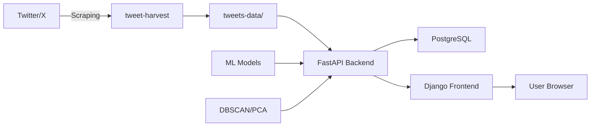

<div align="center">

# SOC-NGANALIS: Social Insight & Analytics

### *Analisis Cerdas untuk Media Sosial Twitter/X dengan AI & Machine Learning*

[](https://www.python.org/)
[](https://fastapi.tiangolo.com/)
[](https://www.djangoproject.com/)
[](https://www.docker.com/)
[](https://www.postgresql.org/)
[](LICENSE)

[Fitur](#-fitur-utama) • [Demo](#-screenshot) • [Instalasi](#-quick-start) • [Dokumentasi](#-dokumentasi) • [API](#-api-reference)


</div>

## 📖 Tentang Proyek

Platform analytics all-in-one yang menggabungkan **scraping Twitter/X**, **analisis sentimen AI**, **clustering machine learning**, dan **visualisasi interaktif** untuk membantu Anda memahami performa media sosial secara mendalam.

### 🎯 Kenapa Platform Ini?

- ✅ **Multi-Dataset Management** - Upload dan kelola berbagai dataset tanpa overwrite
- ✅ **AI-Powered Sentiment Analysis** - Analisis sentimen menggunakan LinearSVM & TF-IDF
- ✅ **Smart Twitter Scraper** - Scrape replies dengan dynamic limit berdasarkan engagement
- ✅ **Topic Modeling** - Identifikasi topik dan pilar konten secara otomatis
- ✅ **Peak Hours Detection** - Temukan jam terbaik untuk posting menggunakan DBSCAN clustering
- ✅ **Interactive Dashboard** - Visualisasi real-time dengan Chart.js
- ✅ **Dockerized** - Deploy dengan satu command

---

## ✨ Fitur Utama

### 🎨 1. Descriptive Analytics
<table>
<tr>
<td width="50%">

#### 📊 Statistics Cards
- Total Posts, Comments, Mentions, Retweets
- Engagement Rate Calculator
- Growth Metrics

#### 📈 Engagement Analysis
- **Pie Chart**: Engagement by Post Type
- **Bar Chart**: Top Hashtags (Top 10)
- **Line Chart**: Engagement by Day of Week
- **Time Series**: Daily activity trends

</td>
<td width="50%">

#### ⏰ Peak Activity Hours
- **DBSCAN Clustering** untuk identifikasi pola
- **PCA Visualization** untuk clustering
- Rekomendasi jam posting optimal
- Heatmap activity per jam

#### 🔍 Deep Dive Analysis
- Post performance breakdown
- Engagement rate per post type
- User interaction patterns

</td>
</tr>
</table>

---

### 🧠 2. Sentiment Analysis (AI-Powered)

```
🤖 Machine Learning Model: LinearSVM + TF-IDF Vectorizer
📊 Classification: Positive, Negative, Neutral
🎯 Accuracy: Trained on Indonesian social media corpus
```

**Fitur:**
- Real-time sentiment prediction untuk setiap reply/comment
- Sentiment distribution pie chart
- Word cloud untuk positive/negative words
- Sentiment timeline analysis
- Export sentiment report

---

### 🏷️ 3. Topic & Pillar Analysis

Identifikasi topik utama dalam diskusi:
- **Topic Extraction** menggunakan NLP
- **Content Pillar Categorization**
- **Hashtag Clustering**
- **Keyword Frequency Analysis**
- Topic trend over time

---

### 😊 4. Emotion Analysis

Klasifikasi emosi lebih detail:
- 😊 Joy (Senang)
- 😢 Sadness (Sedih)
- 😠 Anger (Marah)
- 😨 Fear (Takut)
- 😮 Surprise (Terkejut)

---

### 💡 5. Smart Recommendations

AI-generated recommendations berdasarkan data:
- 🎯 Best time to post
- 📝 Content type recommendations
- #️⃣ Hashtag suggestions
- 📊 Engagement optimization tips

---

### 🗂️ 6. Dataset Manager

**NEW!** Multi-dataset management system:
- Upload dataset baru (tweet.xlsx + replies.csv)
- Switch antara dataset dengan satu klik
- Base dataset tetap aman (immutable)
- View stats per dataset
- Delete dataset yang tidak digunakan

---

## 🏗️ Arsitektur



### 🛠️ Tech Stack

<table>
<tr>
<td>

**Backend**
- FastAPI (Analytics API)
- Django (Web Server)
- PostgreSQL (Database)
- Uvicorn (ASGI Server)

</td>
<td>

**Data Science**
- Pandas (Data Processing)
- Scikit-learn (ML Models)
- DBSCAN (Clustering)
- PCA (Dimensionality Reduction)
- TF-IDF (Text Vectorization)

</td>
<td>

**Frontend**
- HTML5/CSS3/JavaScript
- Chart.js (Visualization)
- Responsive Design
- Modern UI/UX

</td>
<td>

**Infrastructure**
- Docker & Docker Compose
- Node.js (Scraping Tools)
- tweet-harvest (Data Collection)

</td>
</tr>
</table>

---

## 🚀 Quick Start

### 📋 Prerequisites

```bash
✅ Docker & Docker Compose
✅ Node.js 16+ (untuk scraping standalone)
✅ Python 3.10+ (untuk scraping standalone)
✅ Twitter/X Auth Token (untuk scraping)
```

### ⚡ Instalasi & Menjalankan

#### 1️⃣ Clone Repository

```bash
git clone https://github.com/yourusername/crawling_sosmed.git
cd crawling_sosmed
```

#### 2️⃣ Setup Environment Variables

```bash
# Copy .env template
cp .env.example .env

# Edit .env dan tambahkan Twitter Auth Token
nano .env
```

```env
# Twitter Authentication
TWITTER_AUTH_TOKEN=your_twitter_auth_token_here

# Data Paths
DATA_PATH=/home/dimas/crawling_sosmed/tweets-data

# Model Paths
MODEL_PATH=/home/dimas/crawling_sosmed/assets/model/LinearSVM.pkl
VECTORIZER_PATH=/home/dimas/crawling_sosmed/assets/model/tfidf_vectorizer.pkl
```

#### 3️⃣ Jalankan dengan Docker

```bash
# Build dan start semua services
docker compose up --build

# Atau run di background
docker compose up -d --build
```

#### 4️⃣ Akses Aplikasi

🌐 **URLs:**
- 🏠 **Django (Frontend)**: http://localhost:8000
- ⚡ **FastAPI (API)**: http://localhost:8001
- 📚 **API Docs (Swagger)**: http://localhost:8001/docs
- 🗄️ **PostgreSQL**: localhost:5433

---

## 📱 Panduan Penggunaan

### 🔍 1. Scraping Data Twitter

#### **Option A: Docker (Recommended)**

```bash
# Masuk ke FastAPI container
docker compose exec fastapi bash

# Jalankan scraper
python tweet_scraper.py
```

#### **Option B: Standalone Script**

```bash
# Set Twitter token
export TWITTER_AUTH_TOKEN="your_token_here"

# Jalankan script wrapper (auto-check dependencies)
./run_scraper.sh

# Atau langsung
python3 get_Data.py
```

📖 **Dokumentasi Scraping:**
- [QUICK_START.md](QUICK_START.md) - Panduan cepat scraping
- [SCRAPER_README.md](SCRAPER_README.md) - Dokumentasi lengkap

### 📊 2. Upload & Manage Dataset

1. Buka **Dataset Manager**: http://localhost:8000/dataset-manager/
2. Klik **"Upload New Dataset"**
3. Pilih files:
   - `tweet.xlsx` (Header di baris ke-5)
   - `replies.csv` (Hasil scraping)
4. Klik **"Gunakan"** untuk switch dataset
5. Lihat analytics dengan dataset aktif

### 📈 3. View Analytics

Navigasi ke halaman analytics:
- **Descriptive**: http://localhost:8000/analytics/
- **Sentiment**: http://localhost:8000/sentiment/
- **Topic & Pillar**: http://localhost:8000/topic-pillar/
- **Emotion**: http://localhost:8000/emotion/
- **Recommendations**: http://localhost:8000/recommendations/

---

## 🔌 API Reference

### 📡 FastAPI Endpoints

#### **Data Management**

```http
GET  /api/data-status                 # Check data availability & stats
POST /api/upload-dataset               # Upload new dataset (multipart/form-data)
POST /api/select-dataset/{name}        # Switch active dataset
GET  /api/list-datasets                # List all datasets
DELETE /api/delete-dataset/{name}      # Delete dataset
```

#### **Analytics**

```http
GET /api/basic-stats                   # Basic statistics
GET /api/engagement-by-type            # Engagement by post type
GET /api/peak-hours                    # Peak activity hours (DBSCAN)
GET /api/hashtags                      # Top hashtags
GET /api/engagement-by-day             # Engagement by day of week
GET /api/clustering-pca                # PCA clustering visualization
```

#### **Sentiment & Emotion**

```http
GET /api/sentiment-distribution        # Sentiment analysis results
GET /api/emotion-analysis              # Emotion classification
GET /api/sentiment-timeline            # Sentiment over time
```

#### **Topic Analysis**

```http
GET /api/topic-pillars                 # Topic & pillar analysis
GET /api/keyword-frequency             # Keyword frequency analysis
```

#### **Recommendations**

```http
GET /api/recommendations               # AI-generated recommendations
```

### 📝 Example Request

```bash
# Upload new dataset
curl -X POST "http://localhost:8001/api/upload-dataset" \
  -F "dataset_name=indihome_jan2025" \
  -F "tweet_file=@tweet.xlsx" \
  -F "replies_file=@replies.csv"

# Switch to dataset
curl -X POST "http://localhost:8001/api/select-dataset/indihome_jan2025"

# Get analytics
curl "http://localhost:8001/api/basic-stats"
```

---

## 📂 Struktur Project

```
crawling_sosmed/
├── 📄 docker-compose.yml              # Docker orchestration
├── 📄 .env                            # Environment variables
├── 📜 README.md                       # This file
├── 📜 QUICK_START.md                  # Quick scraping guide
├── 📜 SCRAPER_README.md               # Full scraping docs
├── 🐍 run_scraper.sh                  # Scraper wrapper script
│
├── 📁 django_app/                     # Django Frontend
│   ├── 📄 Dockerfile
│   ├── 📄 manage.py
│   ├── 📁 webapp/                     # Project config
│   │   ├── settings.py
│   │   ├── urls.py
│   │   └── wsgi.py
│   └── 📁 analytics/                  # Main app
│       ├── views.py                   # View controllers
│       ├── urls.py                    # URL routing
│       ├── models.py                  # Database models
│       ├── 📁 templates/              # HTML templates
│       │   ├── base.html
│       │   ├── home.html
│       │   ├── descriptive_analytics.html
│       │   ├── sentiment_analysis.html
│       │   ├── topic_pillar.html
│       │   ├── emotion_analysis.html
│       │   ├── recommendations.html
│       │   └── dataset_manager.html   # 🆕 Dataset manager
│       └── 📁 static/
│           ├── css/
│           └── js/
│
├── 📁 fastapi_app/                    # FastAPI Backend
│   ├── 📄 Dockerfile
│   ├── 🐍 main.py                     # Main API application
│   ├── 🐍 data_processor.py           # Data processing utilities
│   ├── 🐍 sentiment_analyzer.py       # Sentiment analysis
│   ├── 🐍 topic_pillar_processor.py   # Topic extraction
│   ├── 🐍 emotion_classifier.py       # Emotion classification
│   └── 🐍 tweet_scraper.py            # Twitter scraper wrapper
│
├── 📁 tweets-data/                    # Data directory
│   ├── 📄 tweet.xlsx                  # Main tweet data (default)
│   ├── 📄 replies.csv                 # All replies (default)
│   └── 📁 datasets/                   # 🆕 Multiple datasets
│       ├── indihome/
│       │   ├── tweet.xlsx
│       │   └── replies.csv
│       └── telkomsel/
│           ├── tweet.xlsx
│           └── replies.csv
│
├── 📁 assets/                         # ML Models & Resources
│   └── 📁 model/
│       ├── LinearSVM.pkl              # Sentiment model
│       └── tfidf_vectorizer.pkl       # Text vectorizer
│
└── 📁 get_data/                       # Scraping utilities
    └── 🐍 replies.py                  # Reply scraping logic
```

---

## 🧪 Data Format

### 📊 tweet.xlsx (Input)

Header dimulai di **baris ke-5** (row 5), format:

| Name | Type | Caption | Date | Likes | Replies | Retweets | Permalink |
|------|------|---------|------|-------|---------|----------|-----------|
| indihome | Photo | Ini caption... | 2025-11-15T19:51:55+07:00 | 150 | 45 | 30 | https://twitter.com/indihome/status/123... |

**Kolom yang digunakan:**
- `Name` - Account name
- `Type` - Post type (Photo, Video, Link, Animated_gif, Status)
- `Caption` - Post content (untuk hashtag extraction)
- `Date` - ISO timestamp
- `Likes`, `Replies`, `Retweets` - Engagement metrics
- `Permalink` - Tweet URL (untuk extract tweet ID)

### 📄 replies.csv (Output)

Format hasil scraping menggunakan tweet-harvest:

| id | conversation_id | created_at | user_id | username | text | ... |
|----|----------------|------------|---------|----------|------|-----|
| 1234... | 5678... | Sat Nov 15 23:59:58 +0000 2025 | 9876... | johndoe | Great service! | ... |

**Kolom tambahan:**
- `reply_to_tweet_id` - ID tweet yang di-reply (ditambahkan oleh scraper)
- `sentiment` - Sentimen analysis result (ditambahkan oleh ML model)
- `emotion` - Emotion classification (ditambahkan oleh ML model)

---

## 🤖 Machine Learning Models

### 1. Sentiment Analysis: LinearSVM

```python
Model: LinearSVM (Scikit-learn)
Vectorizer: TF-IDF
Training Data: Indonesian social media corpus
Classes: ['Positive', 'Negative', 'Neutral']
Preprocessing: Lowercase, remove URLs, mentions, hashtags
```

**Performance:**
- ✅ Optimized for Indonesian language
- ✅ Handles informal text & slang
- ✅ Real-time inference (<10ms per text)

### 2. Clustering: DBSCAN

```python
Algorithm: DBSCAN (Density-Based Spatial Clustering)
Use Case: Peak hours detection
Parameters: eps=0.5, min_samples=5
Features: Hour of day (0-23)
```

**Output:**
- Cluster labels untuk setiap jam
- Optimal posting hours
- Activity patterns

### 3. Dimensionality Reduction: PCA

```python
Algorithm: PCA (Principal Component Analysis)
Use Case: Clustering visualization
Components: 2D projection
```

---

## 🐳 Docker Configuration

### Services

#### 🗄️ PostgreSQL Database
```yaml
Port: 5433 (host) → 5432 (container)
Database: socialdb
User: socialuser
Volume: postgres_data (persistent)
```

#### 🌐 Django Frontend
```yaml
Port: 8000
Volumes:
  - ./django_app:/app
  - ./tweets-data:/home/dimas/crawling_sosmed/tweets-data
```

#### ⚡ FastAPI Backend
```yaml
Port: 8001
Volumes:
  - ./fastapi_app:/app
  - ./tweets-data:/home/dimas/crawling_sosmed/tweets-data
  - ./assets:/home/dimas/crawling_sosmed/assets
Memory: 2GB limit, 512MB reserved
Hot Reload: Enabled
```

### Useful Commands

```bash
# Start services
docker compose up -d

# View logs
docker compose logs -f

# Restart specific service
docker compose restart fastapi

# Enter container
docker compose exec fastapi bash
docker compose exec django bash

# Stop all
docker compose down

# Remove volumes (⚠️ deletes data)
docker compose down -v

# Rebuild after code changes
docker compose up --build
```

---

## 🔧 Troubleshooting

### ❌ Port Already in Use

```bash
# Check what's using port
sudo lsof -i :8000
sudo lsof -i :8001
sudo lsof -i :5433

# Stop services
docker compose down
```

### ❌ Missing Python Dependencies (Standalone Script)

```bash
# Install for Python 3.10
python3.10 -m pip install pandas openpyxl

# Or use pip3
pip3 install pandas openpyxl
```

### ❌ Node.js Not Found (Scraping)

```bash
# Ubuntu/Debian
sudo apt-get install nodejs npm

# Verify
node --version
npm --version
```

### ❌ Twitter Auth Token Invalid

1. Buka https://twitter.com atau https://x.com
2. Login ke akun Anda
3. Tekan **F12** → Tab **Application**
4. **Cookies** → pilih `https://twitter.com`
5. Copy cookie `auth_token`
6. Update `.env` atau environment variable

### ❌ No Data Showing in Dashboard

```bash
# Check active dataset
curl http://localhost:8001/api/data-status

# Switch to correct dataset
curl -X POST http://localhost:8001/api/select-dataset/indihome

# Verify files exist
ls -lh tweets-data/
ls -lh tweets-data/datasets/
```

### ❌ FastAPI Container Crashes

```bash
# Check logs
docker compose logs fastapi

# Common issues:
# 1. Missing python-multipart (should be in Dockerfile)
# 2. Memory limit (adjust in docker-compose.yml)
# 3. Model files missing (check assets/model/)

# Rebuild
docker compose build fastapi
docker compose up -d fastapi
```

---

## 🎓 Dokumentasi Tambahan

- 📘 [QUICK_START.md](QUICK_START.md) - Panduan cepat untuk scraping Twitter
- 📗 [SCRAPER_README.md](SCRAPER_README.md) - Dokumentasi lengkap scraper
- 📙 [DOKUMENTASI_APLIKASI.md](DOKUMENTASI_APLIKASI.md) - Dokumentasi teknis aplikasi
- 📕 [FEATURE_POST_MODAL.md](FEATURE_POST_MODAL.md) - Fitur post detail modal

---

## 🛣️ Roadmap

### 🎯 Coming Soon

- [ ] **Real-time Monitoring** - WebSocket untuk live updates
- [ ] **Export Reports** - PDF/Excel export dengan branding
- [ ] **Advanced Filters** - Date range, account, sentiment filters
- [ ] **User Authentication** - Login & role-based access
- [ ] **Multi-Platform** - Support Instagram, Facebook, LinkedIn
- [ ] **Automated Scheduling** - Cron jobs untuk periodic scraping
- [ ] **Email Alerts** - Notifikasi untuk sentiment spike/drop
- [ ] **Comparison Mode** - Compare multiple datasets side-by-side
- [ ] **API Rate Limiting** - Redis-based rate limiter
- [ ] **Dark Mode** - Dark theme untuk dashboard

### 🚀 Future Enhancements

- **NLP Improvements**
  - Named Entity Recognition (NER)
  - Aspect-Based Sentiment Analysis
  - Sarcasm Detection
  - Multilingual Support

- **Advanced Analytics**
  - Influencer Detection
  - Trend Forecasting
  - Viral Content Prediction
  - Community Detection

- **Infrastructure**
  - Kubernetes deployment
  - CI/CD pipeline
  - Auto-scaling
  - Monitoring (Prometheus/Grafana)

---

## 🤝 Contributing

Kontribusi sangat diterima! Silakan:

1. Fork repository ini
2. Create feature branch (`git checkout -b feature/AmazingFeature`)
3. Commit changes (`git commit -m 'Add some AmazingFeature'`)
4. Push to branch (`git push origin feature/AmazingFeature`)
5. Open Pull Request

### 📝 Contribution Guidelines

- Gunakan meaningful commit messages
- Update dokumentasi jika ada perubahan API
- Tambahkan unit tests untuk fitur baru
- Follow PEP 8 (Python) dan ESLint (JavaScript)

---

## 📄 License

Distributed under the MIT License. See `LICENSE` for more information.

---

## 👨‍💻 Author

**Dimas**

- GitHub: [@yourusername](https://github.com/yourusername)
- Email: your.email@example.com

---

## 🙏 Acknowledgments

- [tweet-harvest](https://github.com/th3c0d3br34ker/tweet-harvest) - Twitter scraping tool
- [FastAPI](https://fastapi.tiangolo.com/) - Modern Python web framework
- [Django](https://www.djangoproject.com/) - High-level Python web framework
- [Chart.js](https://www.chartjs.org/) - Beautiful charts library
- [Scikit-learn](https://scikit-learn.org/) - Machine learning library

---

<div align="center">

### ⭐ Star this repo if you find it helpful!

Made with ❤️ by Dimas


**[⬆ Back to Top](#-social-media-analytics-platform)**

</div>
